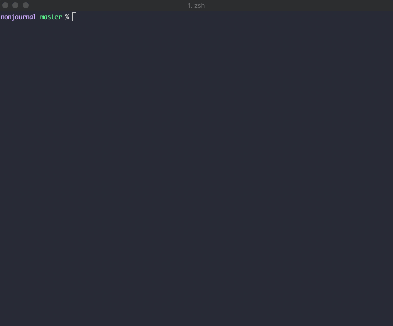

# nonjournal

my journaling "software"

## Getting Started

1. Clone the repo
2. Install the dependencies
  `yarn install`
3. To create a new entry, run:
  `yarn entry`
4. Start writing! A new entry will be created in `/entries/`
